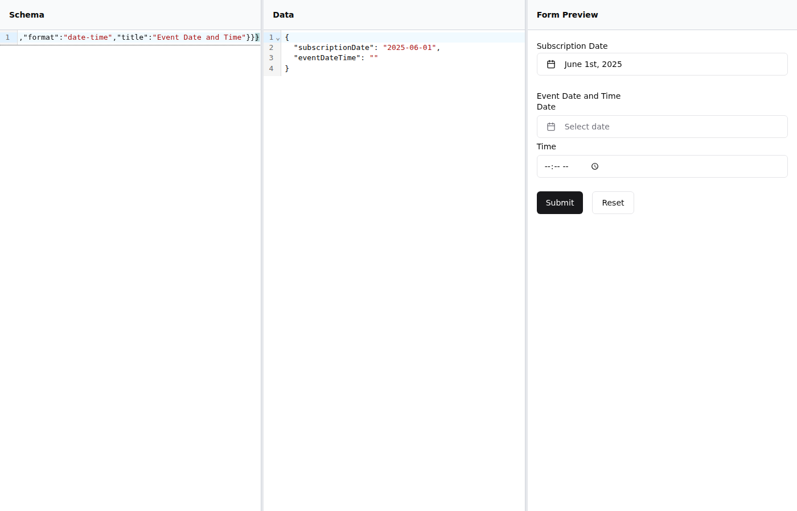
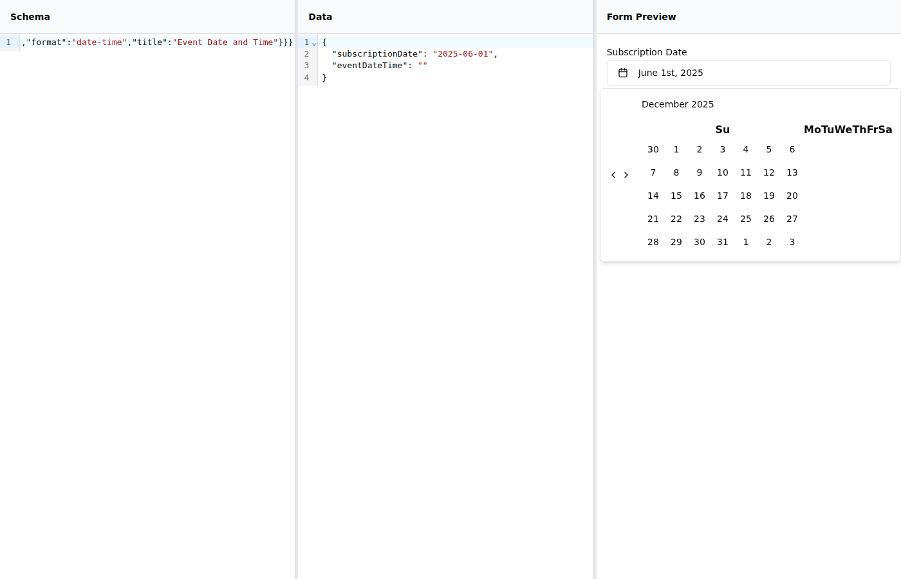
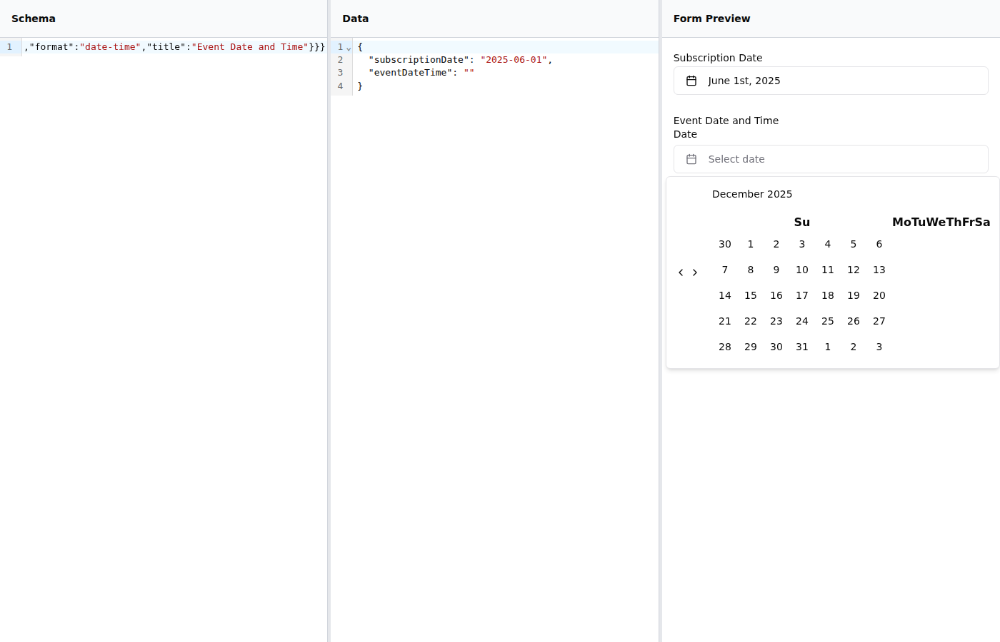

# Date/DateTime Picker Screenshots

This document provides the correct markdown syntax to reference screenshots in PR descriptions and comments.

## ⚠️ IMPORTANT: How to Reference Screenshots

**CORRECT way to show screenshots in markdown:**

```markdown



```

**Result:**


## Screenshot Descriptions

### new-01-form.png
Shows the form with both date and datetime pickers:
- **Subscription Date**: Button with "June 1st, 2025" and calendar icon (matches shadcn)
- **Event Date and Time**: Two vertically stacked fields - Date button with "Select date" and Time input (matches shadcn)

### new-02-date-open.png
Shows the date picker with calendar popover open:
- Large calendar dropdown with month/year navigation
- Proper calendar grid styling
- Matches shadcn/ui "Picker with Input" specification exactly

### new-03-datetime-open.png
Shows the datetime picker with calendar open:
- Date button with calendar popover displayed
- Time input field visible separately below
- Vertical stacking matches shadcn/ui datetime picker reference
